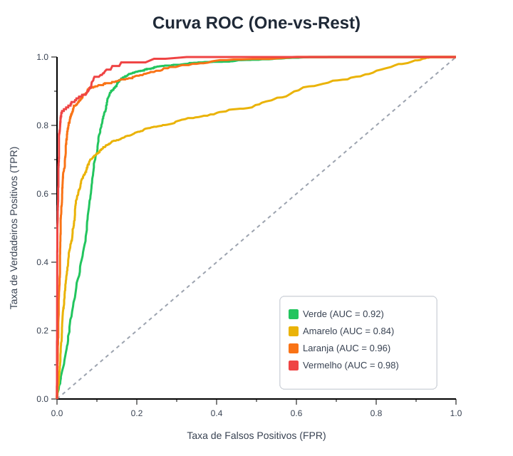
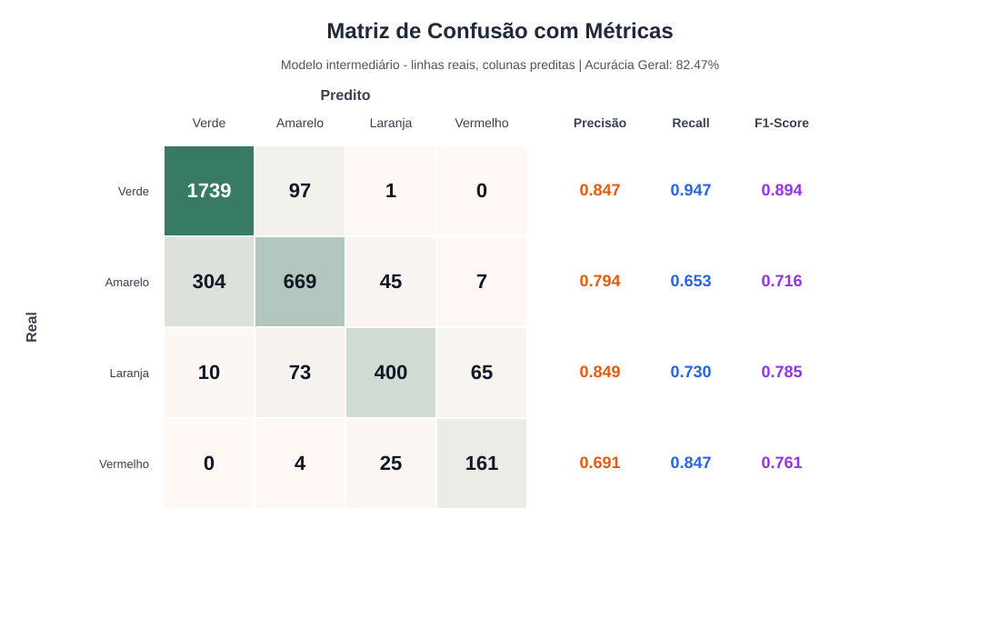

---

# Triagem Inteligente de Pronto-Socorro

Projeto de classificação multiclasse para prioridade de atendimento no Protocolo de Manchester simplificado:
Verde, Amarelo, Laranja e Vermelho.

## Visão geral

Este projeto simula um sistema de apoio à triagem em pronto-socorro. A ideia é receber dados
clínicos iniciais de um paciente, como idade, pressão, temperatura, frequência cardíaca,
saturação de oxigênio, dor, comorbidades e forma de chegada, e estimar automaticamente o nível
de prioridade do atendimento.

O objetivo não é substituir o profissional de saúde, mas apoiar a decisão em ambientes de alta
demanda. Em uma UPA ou pronto-socorro lotado, erros de subclassificação podem atrasar o
atendimento de pacientes graves. Por isso, o projeto dá mais importância para identificar casos
`Vermelho`, ou seja, emergências com necessidade de atendimento imediato.

## Classes de triagem

O modelo trabalha com quatro classes do Protocolo de Manchester simplificado:

- `Verde`: Não urgente, pode aguardar;
- `Amarelo`: Urgente, atendimento em até 60 minutos;
- `Laranja`: Muito urgente, atendimento em até 10 minutos;
- `Vermelho`: Emergência, atendimento imediato.

No dataset, essas classes aparecem numericamente em `triage_level`:

- `0`: Verde;
- `1`: Amarelo;
- `2`: Laranja;
- `3`: Vermelho.

## Como o projeto funciona

O arquivo principal é `triagem_ia.py`. Ele possui dois modos:

- `train`: Treina os modelos, calcula métricas, gera a curva ROC, salva o melhor modelo e gera a matriz de confusão;
- `predict`: Carrega o modelo salvo e classifica um novo paciente informado pela linha de comando.

Durante o treino, o projeto compara duas abordagens:

- Baseline com Regressão Logística pelo fato de que retorna a porcentagem de chance de o paciente pertencer àquela classe; essa regressão é feita usando sinais vitais principais e SMOTE para balanceamento, que consiste em uma tática onde ocorre a duplicação dos dados em menor quantidade;
- Modelo intermediário com Random Forest, que é um algoritmo que combina várias árvores de decisões em uma só. Ele funciona usando sinais vitais, nível de dor, comorbidades,
  visitas anteriores e forma de chegada.

O melhor modelo salvo atualmente é o `random_forest_intermediario`. Além da previsão normal do
classificador, ele usa uma regra conservadora para segurança clínica: se a probabilidade de
`Vermelho` for maior ou igual a `0.20`, a predição final é forçada para `Vermelho`. Essa regra
reduz o risco de deixar passar uma emergência como se fosse um caso menos grave.

## Dados usados

As fontes citadas no documento do projeto não precisam estar todas fisicamente na pasta final para
o modelo funcionar. Elas tem papeis diferentes:

- `DATASUS / SIHSUS` : É uma fonte brasileira importante para contextualizar o problema, analisar
  internacoes, CID-10, idade, UTI, permanencia e desfechos. Porém, esses registros não trazem
  diretamente a classificação de triagem Manchester (`Verde`, `Amarelo`, `Laranja`, `Vermelho`).
  Por isso, eles não foram usados no treino supervisionado final.
- `Emergency CAS Dataset` : Pode ser usado como fonte adicional caso seja necessário comparar com
  outra base publica de pronto-socorro. Ele não e obrigatorio para executar a versão atual do
  projeto. [Link](https://www.kaggle.com/datasets/xavierberge/hospital-emergency-dataset)
- `Patient Triage Dataset` : Dataset sintético de triagem: E a base mais alinhada ao objetivo,
  porque contém sinais vitais e um rotulo de prioridade. A versão presente no projeto é
  `data/synthetic_medical_triage.csv`. [Link](https://www.kaggle.com/datasets/emirhanakku/synthetic-medical-triage-priority-dataset)
- Dados sinteticos / SMOTE: O projeto usa balanceamento com SMOTE no baseline para lidar com
  classes desbalanceadas. No modelo intermediario, a segurança da classe `Vermelho` é reforçada
  com um limiar conservador de probabilidade.

Assim, a entrega final fica mais enxuta: Mantém apenas o dataset necessário para treinar e avaliar
o classificador de triagem. Os arquivos auxiliares do SIHSUS foram removidos porque aumentavam o
tamanho da pasta e não acrescentavam rotulos utilizaveis para este modelo.

O treino pode utilizar o dataset sintético ideal (`data/synthetic_medical_triage.csv`), porém, para simular um ambiente de pronto-socorro do mundo real com dados orgânicos (sujeitos a ruído de sensores, incerteza humana e omissões no registro), utilizamos o script **`sujar_dados.py`**.

O `sujar_dados.py` gera um novo dataset chamado `data/synthetic_medical_triage_noisy.csv` aplicando:
- **Injeção de Ruído:** Desvios normais em sensores (ex: saturação de oxigênio e pressão arterial).
- **Regras Probabilísticas (Subjetividade):** Troca de classes em limites adjacentes simulando a divergência de enfermeiros.
- **Missing Data (NaN):** Valores nulos inseridos de forma aleatória e estruturada (ex: pacientes vermelhos indo direto para a emergência sem preencher o histórico).

Isso impede que o modelo simplesmente decore regras determinísticas matemáticas e testa a real robustez da imputação e da Random Forest.

## Estrutura do projeto

```text
data/
  synthetic_medical_triage.csv
  synthetic_medical_triage_noisy.csv
models/
  modelo_triagem.joblib
reports/
  curva_roc.csv
  curva_roc.svg
  metricas_triagem.json
  matriz_confusao.csv
  matriz_confusao.svg
baseline.py
sujar_dados.py
triagem_ia.py
README.md
requirements.txt
```

Arquivos principais:

- `triagem_ia.py`: Implementa treino, avaliação, salvamento do modelo, geração da Curva ROC e predição;
- `sujar_dados.py`: Script para corromper os dados de forma controlada e gerar uma avaliação realista;
- `reports/curva_roc.svg`: Gráfico da Curva ROC (One-vs-Rest) visualizando o desempenho de probabilidade de cada classe;
- `models/modelo_triagem.joblib`: Modelo treinado salvo em disco;
- `reports/metricas_triagem.json`: Métricas completas dos modelos avaliados;
- `reports/matriz_confusao.svg`: Matriz de confusão visual.

## Como treinar

Para treinar com os dados realistas ruidosos:

```powershell
.\.venv\Scripts\python.exe triagem_ia.py train --data data\synthetic_medical_triage_noisy.csv
```

Saídas geradas:

- `models/modelo_triagem.joblib`
- `reports/metricas_triagem.json`
- `reports/matriz_confusao.csv`
- `reports/matriz_confusao.svg`
- `reports/curva_roc.csv`
- `reports/curva_roc.svg`

## Resultado atual (Com Dados Ruidosos/Realistas)

Ao treinar o modelo na base com as interferências da vida real (`synthetic_medical_triage_noisy.csv`), as métricas refletem a dificuldade orgânica do problema. O Random Forest intermediário obtém os seguintes resultados:

- Macro F1: `0.7892`;
- Recall da classe Vermelho: `0.8474`;
- Tempo médio de inferência: `0.000039` segundo por paciente.

Esses valores demonstram uma queda em relação ao dado perfeitamente sintético, o que já era esperado. Ainda assim, atestam que o classificador consegue encontrar padrões valiosos.

## Curva ROC

O projeto gera uma curva ROC (One-vs-Rest) salva em `reports/curva_roc.svg`, acompanhada do respectivo CSV. O gráfico plota a Taxa de Verdadeiros Positivos (TPR) contra a Taxa de Falsos Positivos (FPR) para as 4 classes (Verde, Amarelo, Laranja e Vermelho). Essa visualização com suas pontuações AUC permite entender como as probabilidades geradas pelo modelo conseguem separar bem cada nível de prioridade.



## Matriz de confusão

A matriz de confusão mostra onde o modelo acertou e errou. As linhas representam a classe real e as colunas representam a classe prevista. Ela é salva em formato vetorizado (`matriz_confusao.svg`) para facilitar a visualização e interpretação.


## Como predizer um paciente

```powershell
.\.venv\Scripts\python.exe triagem_ia.py predict `
  --idade 79 `
  --frequencia-cardiaca 148 `
  --pressao-sistolica 159 `
  --spo2 96 `
  --temperatura 39.3 `
  --dor 10 `
  --comorbidades 4 `
  --visitas-previas 2 `
  --chegada ambulance
```

## Metas do projeto

- Macro F1 acima de 0.80 (tendo em mente a dificuldade com dados ruidosos);
- Recall da classe Vermelho acima de 0.95;
- Tempo de inferência abaixo de 2 segundos por paciente.

## Limitações

Este projeto é um protótipo acadêmico. Ele usa dados tabulares rotulados e não deve ser usado em ambiente clínico real sem validação com dados reais, revisão médica, testes de viés, auditoria e integração segura ao fluxo de atendimento. A saída do modelo deve ser interpretada como apoio à decisão, nunca como diagnóstico automático.

---
