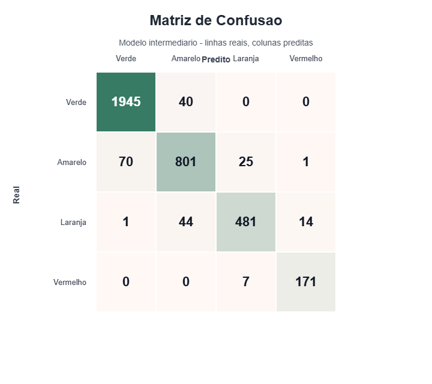

# Triagem Inteligente de Pronto-Socorro

Projeto de classificacao multiclasse para prioridade de atendimento no Protocolo de Manchester simplificado:
Verde, Amarelo, Laranja e Vermelho.

## Visao geral

Este projeto simula um sistema de apoio a triagem em pronto-socorro. A ideia e receber dados
clinicos iniciais de um paciente, como idade, pressao, temperatura, frequencia cardiaca,
saturacao de oxigenio, dor, comorbidades e forma de chegada, e estimar automaticamente o nivel
de prioridade do atendimento.

O objetivo nao e substituir o profissional de saude, mas apoiar a decisao em ambientes de alta
demanda. Em uma UPA ou pronto-socorro lotado, erros de subclassificacao podem atrasar o
atendimento de pacientes graves. Por isso, o projeto da mais importancia para identificar casos
`Vermelho`, ou seja, emergencias com necessidade de atendimento imediato.

## Classes de triagem

O modelo trabalha com quatro classes do Protocolo de Manchester simplificado:

- `Verde`: Não urgente, pode aguardar;
- `Amarelo`: Urgente, atendimento em ate 60 minutos;
- `Laranja`: Muito urgente, atendimento em ate 10 minutos;
- `Vermelho`: Emergência, atendimento imediato.

No dataset, essas classes aparecem numericamente em `triage_level`:

- `0`: Verde;
- `1`: Amarelo;
- `2`: Laranja;
- `3`: Vermelho.

## Como o projeto funciona

O arquivo principal e `triagem_ia.py`. Ele possui dois modos:

- `train`: Treina os modelos, calcula metricas, salva o melhor modelo e gera a matriz de confusao;
- `predict`: Carrega o modelo salvo e classifica um novo paciente informado pela linha de comando.

Durante o treino, o projeto compara duas abordagens:

- Baseline com Regressao Logistica pelo fato que retorna a porcentagem de chance de o paciente pertencer aquela classe, essa regressão é feita usando sinais vitais principais e SMOTE para balanceamento, que consiste em uma tática onde acontece o duplicamento dos dados em menor quantidade;
- Modelo intermediario com Random Forest, que é um algoritmo que combina várias árvores de decisões em uma só. Ele funciona usando sinais vitais, nivel de dor, comorbidades,
  visitas anteriores e forma de chegada.

O melhor modelo salvo atualmente e o `random_forest_intermediario`. Alem da previsao normal do
classificador, ele usa uma regra conservadora para seguranca clinica: se a probabilidade de
`Vermelho` for maior ou igual a `0.20`, a predicao final e forcada para `Vermelho`. Essa regra
reduz o risco de deixar passar uma emergencia como se fosse um caso menos grave.

## Dados usados

O treino principal usa `data/synthetic_medical_triage.csv`, que contem sinais vitais, nivel de dor,
historico simples, meio de chegada e o rotulo `triage_level`, que representa a prioridade de
triagem. Esse arquivo foi mantido porque ele tem exatamente o tipo de alvo necessario para
aprendizado supervisionado: uma entrada clinica do paciente e uma classe de prioridade conhecida.

As fontes citadas no documento do projeto nao precisam estar todas fisicamente na pasta final para
o modelo funcionar. Elas tem papeis diferentes:

- `DATASUS / SIHSUS` : É uma fonte brasileira importante para contextualizar o problema, analisar
  internacoes, CID-10, idade, UTI, permanencia e desfechos. Porem, esses registros não trazem
  diretamente a classificacao de triagem Manchester (`Verde`, `Amarelo`, `Laranja`, `Vermelho`).
  Por isso, eles nao foram usados no treino supervisionado final.
- `Emergency CAS Dataset` : Pode ser usado como fonte adicional caso seja necessário comparar com
  outra base publica de pronto-socorro. Ele não e obrigatorio para executar a versão atual do
  projeto. [Link](https://www.kaggle.com/datasets/xavierberge/hospital-emergency-dataset)
- `Patient Triage Dataset` : Dataset sintético de triagem: E a base mais alinhada ao objetivo,
  porque contém sinais vitais e um rotulo de prioridade. A versão presente no projeto e
  `data/synthetic_medical_triage.csv`. [Link](https://www.kaggle.com/datasets/emirhanakku/synthetic-medical-triage-priority-dataset)
- Dados sinteticos / SMOTE: O projeto usa balanceamento com SMOTE no baseline para lidar com
  classes desbalanceadas. No modelo intermediario, a seguranca da classe `Vermelho` e reforcada
  com um limiar conservador de probabilidade.

Assim, a entrega final fica mais enxuta: Mantém apenas o dataset necessario para treinar e avaliar
o classificador de triagem. Os arquivos auxiliares do SIHSUS foram removidos porque aumentavam o
tamanho da pasta e nao acrescentavam rotulos utilizaveis para este modelo.

## Estrutura do projeto

```text
data/
  synthetic_medical_triage.csv
models/
  modelo_triagem.joblib
reports/
  metricas_triagem.json
  matriz_confusao.csv
  matriz_confusao.svg
baseline.py
triagem_ia.py
README.md
```

Arquivos principais:

- `triagem_ia.py`: Implementa treino, avaliacao, salvamento do modelo e predicao;
- `baseline.py`: Atalho para executar o mesmo fluxo principal;
- `models/modelo_triagem.joblib`: Modelo treinado salvo em disco;
- `reports/metricas_triagem.json`: Metricas completas dos modelos avaliados;
- `reports/matriz_confusao.csv`: Matriz de confusao em formato tabular;
- `reports/matriz_confusao.svg`: Matriz de confusao visual.

## Como treinar

```powershell
.\.venv\Scripts\python.exe triagem_ia.py train
```

O comando treina:

- Baseline com Regressao Logística + imputação + SMOTE;
- Modelo intermediário com Random Forest + imputação + one-hot em `arrival_mode`;
- Limiar conservador para Vermelho: Se a probabilidade de emergência for maior ou igual a 0.20,
  a saida é forçada para Vermelho;
- Avaliação com Macro F1, recall da classe Vermelho e tempo médio de inferência.

Saídas geradas:

- `models/modelo_triagem.joblib`
- `reports/metricas_triagem.json`
- `reports/matriz_confusao.csv`
- `reports/matriz_confusao.svg`

## Resultado atual

No treino atual, o melhor modelo foi o Random Forest intermediario:

- Macro F1: `0.9311`;
- Recall da classe Vermelho: `0.9607`;
- Tempo médio de inferência: `0.000045` segundo por paciente.

Esses valores indicam que o modelo atende as três metas definidas: Boa performance geral entre as
classes, alta sensibilidade para emergências e resposta rápida o suficiente para uso em tempo real.

## Matriz de confusao

A matriz de confusão mostra onde o modelo acertou e errou. As linhas representam a classe real e
as colunas representam a classe prevista:



O ponto mais importante e a ultima linha: Dos casos reais `Vermelho`, o modelo classificou `171`
corretamente como `Vermelho` e apenas `7` como `Laranja`. Isso gera recall de aproximadamente
`96.07%` para emergencias.

## Como predizer um paciente

```powershell
.\.venv\Scripts\python.exe triagem_ia.py predict `
  --idade 79 `
  --frequencia-cardiaca 148 `
  --pressao-sistolica 159 `
  --spo2 96 `
  --temperatura 39.3 `
  --dor 10 `
  --comorbidades 4 `
  --visitas-previas 2 `
  --chegada ambulance
```

## Metas do projeto

- Macro F1 acima de 0.80;
- Recall da classe Vermelho acima de 0.95;
- Tempo de inferência abaixo de 2 segundos por paciente.

## Limitações

Este projeto e um prototipo academico. Ele usa dados tabulares rotulados e não deve ser usado em
ambiente clinico real sem validacao com dados reais, revisao médica, testes de vies, auditoria e
integracao segura ao fluxo de atendimento. A saida do modelo deve ser interpretada como apoio a
decisão, nunca como diagnostico automatico.
